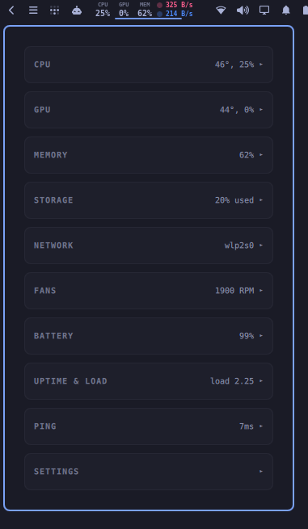
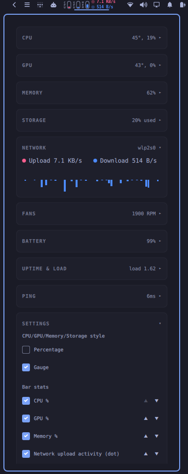
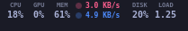

# Quattro Stats

An [Omarchy](https://omarchy.org/) (Quattro) plugin: an iStat Menus-style
system monitor for the bar. A compact, fully customizable pill lives in the
bar; clicking it opens a full dashboard.

<p align="center">
  
  
</p>
<p align="center">
  
</p>

## Bar pill

Pick exactly what shows in the bar, and in what order, from the in-popup
Settings card:

- **CPU / GPU / Memory / Storage** — as plain percentage text, or switch the
  whole group to a small vertical usage gauge (label to the left) via one
  style toggle
- **Battery** — a hand-drawn battery icon (no icon-font dependency) whose fill
  tracks charge level, plus a two-line readout: time-to-10% while on battery,
  time-to-full while charging, a bolt once fully charged, and percent below
- **Fan speed**, **load average** — compact numeric readouts
- **Disk I/O** — two small dots (read/write) that just pulse while active, no
  digits, so the pill's width never jitters
- **Network** — upload/download, each a pulsing dot + rate, stacked vertically

Every item above is individually enabled/disabled, and enabled items can be
reordered with ▲/▼ buttons — all from the Settings card in the popup, no
config file editing required. Everything not shown in the bar is still one
click away in the dashboard.

## Dashboard (click the pill)

Each card starts collapsed with a quick glance stat in its header (e.g. CPU
shows temp + %, Network shows the active interface) and expands on click:

- **CPU** — stacked user/system history graph, temperature
- **GPU** — utilization ring, temperature, clock, memory (NVIDIA via `nvidia-smi`)
- **Memory** — usage ring, used/cached/free breakdown
- **Storage** — usage ring for `/`, available space, live read/write graph
- **Network** — live upload/download graph, current rates, active interface
- **Fans** — RPM per fan (via `lm-sensors`)
- **Battery** — charge ring, health ring, status (skipped if no battery is present)
- **Uptime & Load** — uptime text, 1/5/15-minute load average
- **Ping** — latency to a configurable host (default `1.1.1.1`)
- **Settings** — bar-item show/hide + reorder, dashboard-section show/hide,
  CPU/GPU/Memory/Storage display style

Which cards appear at all is also configurable from Settings.

## High-usage notifications

The background service watches CPU, GPU, Memory, and Storage on every poll
and fires a desktop notification (via `omarchy-notification-send`) the
moment any of them crosses 90% usage. It won't spam: each metric alerts once
per breach and only resets once it drops back below 85%.

## Data sources

`scripts/quattro-stats.py` samples `/proc` twice, one second apart, to
compute CPU/network/disk-io rates, then emits one JSON document per run.
Every external tool is optional and degrades gracefully:

| Metric              | Source                                    |
|----------------------|--------------------------------------------|
| CPU %, load          | `/proc/stat`, `/proc/loadavg`              |
| Memory               | `/proc/meminfo`                            |
| Disk usage           | `df`                                       |
| Disk I/O             | `/proc/diskstats`                          |
| Network              | `/proc/net/dev`, `ip route`                |
| CPU temp, fans       | `sensors -j` (lm-sensors)                  |
| GPU                  | `nvidia-smi`                               |
| Battery              | `/sys/class/power_supply/BAT0`, `AC0`      |
| Uptime               | `/proc/uptime`                             |
| Ping                 | `ping`                                     |

Environment variables:

- `QUATTRO_PING_HOST` — ping target (default `1.1.1.1`).
- `QUATTRO_BATTERY_DIR` — battery sysfs path (default `/sys/class/power_supply/BAT0`).

## Requirements

- Quickshell (the shell Omarchy ships)
- `python3`, `ping`, `df`, `ip` (standard on Omarchy)
- optional: `lm-sensors` (`sensors -j`) for CPU temp / fan RPM
- optional: `nvidia-smi` for GPU stats

## Install

```sh
omarchy plugin add https://github.com/PtrckM/quattro-stats.git --enable
```

## Try it locally

To develop against a working copy instead of an installed release:

```sh
ln -s /path/to/quattro-stats ~/.config/omarchy/plugins/ptrck.quattro-stats
omarchy plugin validate ~/.config/omarchy/plugins/ptrck.quattro-stats
omarchy plugin enable ptrck.quattro-stats right
```

QML changes are picked up on the next `omarchy plugin disable`/`enable`
cycle, or a full `omarchy restart shell` if that doesn't seem to take (this
project's own Quickshell build has occasionally needed the harder reset —
clearing `~/.cache/quickshell/qmlcache/` first if a restart alone doesn't
pick up an edit).

To remove the symlink when done:

```sh
omarchy plugin disable ptrck.quattro-stats
rm ~/.config/omarchy/plugins/ptrck.quattro-stats
```

## Layout

```
ptrck.quattro-stats/
├── manifest.json          plugin manifest (kinds: service, bar-widget)
├── README.md
├── LICENSE
├── preview.png            marketplace preview image
├── screenshots/           README screenshots
├── qml/
│   ├── Panel.qml          bar-widget entry point: Ui.Panel root (pill + dashboard + settings)
│   ├── Service.qml        service entry point (poller process, shared state, history, alerts)
│   ├── HostTokens.qml     bar-theming adapter (Shibumi + stock bar interface)
│   ├── BarPill.qml        customizable multi-stat bar pill (text/gauge/dot/stack/battery segments)
│   ├── Gauge.qml          circular ring gauge (Canvas)
│   ├── HistoryChart.qml   stacked/mirrored bar-history chart (Canvas)
│   └── QuattroFormat.js   pure formatting helpers (rates, bytes, uptime, ...)
└── scripts/
    ├── quattro-stats.sh   collector wrapper (bash)
    └── quattro-stats.py   collector (stdlib only, no third-party deps)
```

## How it works with the shell

- The widget resolves its service through
  `bar.shell.serviceFor("ptrck.quattro-stats")`.
- The service polls only while a widget is mounted (`acquire()`/`release()`),
  keeps a capped rolling history (60 samples) for the CPU/network/disk
  graphs, and tracks per-metric alert state for the 90% notifications.
- The popup is a `Ui.Panel` + `KeyboardPanel`, with the `KeyboardPanel` as a
  direct child of the mounted root — required for the Shibumi bar's
  hosted-panel adapter to re-anchor and re-size the card correctly.
- Bar-item show/hide, order, dashboard-section visibility, and display style
  are all plain settings persisted to the widget's inline `shell.json` entry
  via `bar.shell.updateEntryInline(...)` (the same mechanism the built-in
  Argus plugin uses) — no separate config file.

## License

MIT — see [LICENSE](LICENSE).
